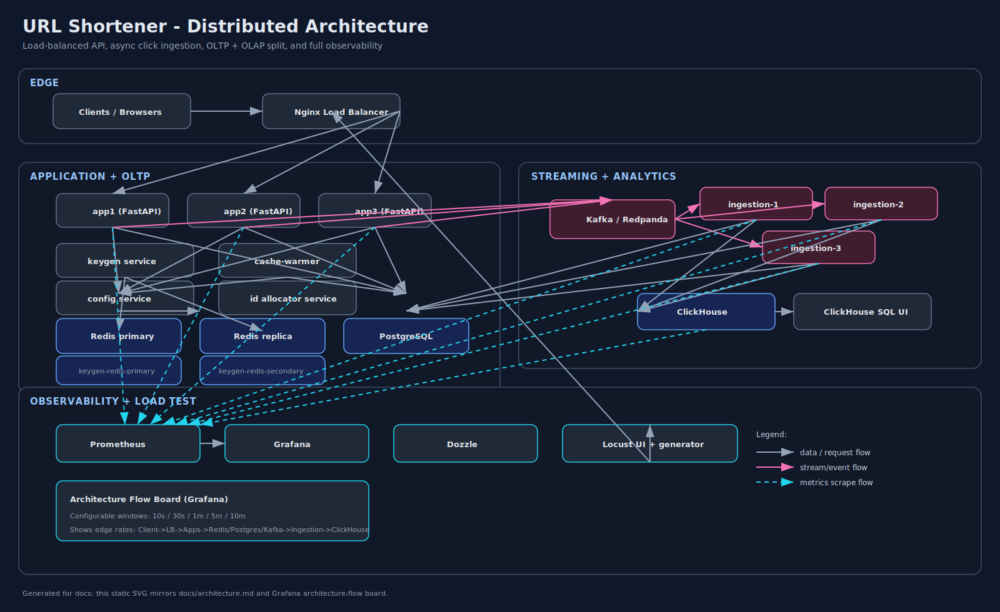
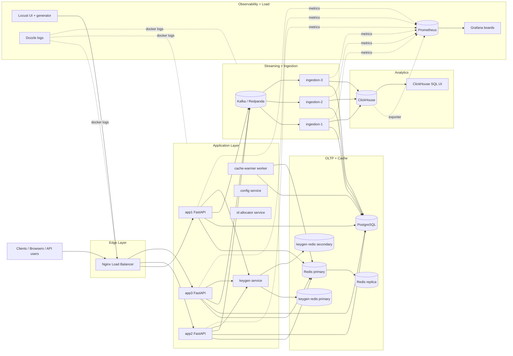

# Architecture

## Overview

This project runs a **distributed URL shortener platform** with:

- load-balanced stateless app nodes,
- split OLTP and OLAP responsibilities,
- asynchronous click ingestion,
- dedicated key-generation service,
- multi-layer observability and load testing.

It is designed to keep redirect latency low while preserving high write throughput and analytics fidelity.

## End-to-End Architecture Diagram

Static SVG: [`docs/diagrams/architecture.svg`](./diagrams/architecture.svg)

## Core Runtime Flows

### 1) Shorten URL (`POST /api/shorten`)

1. Client hits LB -> routed to one app node.
2. App requests a short-code range block from `keygen` when local block exhausts.
3. App validates uniqueness in Postgres.
4. URL mapping persisted in Postgres.
5. Cache entry populated in Redis.

### 2) Redirect (`GET /{short_code}`)

1. App checks Redis cache (`url:{short_code}`).
2. On miss: fetches from Postgres and warms cache.
3. Redirect response returns `307`.
4. Click count is incremented in Redis buffer for async processing.
5. Background job flushes Redis buffers to Kafka every 1 second.
6. Near-real-time buffered click value stays in Redis for quick stats reads.

### 3) Ingestion / Analytics

1. Ingestion workers consume click events from Kafka topics.
2. They aggregate and deduplicate events from Kafka stream.
3. Every 5 seconds, aggregated batch flushes to:
   - Postgres `urls.clicks` (OLTP truth for API stats),
   - ClickHouse `click_events` (analytics store).
4. Redis buffers are cleared after successful Kafka publish.

## Design Decisions & Trade-offs

### Redis Buffer Management Strategy

**1-Second Buffer Flush to Kafka**
- Click events are immediately buffered in Redis for sub-millisecond redirect latency
- Every 1 second, a background job flushes accumulated buffers to Kafka topics
- This provides the best of both worlds: fast redirects + durable event streaming
- Kafka acts as the durable audit trail and enables replay capabilities

**Redis AOF (Append Only File) Configuration**
- Redis is configured with AOF persistence for maximum durability
- `appendfsync everysec` provides balance between performance and data safety
- In case of Redis failure, AOF ensures no click events are lost
- AOF rewrite process runs in background to maintain file size efficiency

**Multi-Layer Data Loss Prevention**
1. **Immediate Redis buffer**: Captures every click instantly
2. **Kafka persistence**: Durable, replicated event log
3. **Postgres updates**: Periodic batch writes from ingestion
4. **ClickHouse archival**: Long-term analytics storage

### Reconciliation & Data Consistency

**Event Sourcing Pattern**
- All click events are stored in Kafka as immutable events
- Postgres maintains materialized view (aggregated counts)
- ClickHouse provides analytical view of raw events
- Any discrepancy can be reconciled by replaying Kafka events

**Idempotent Processing**
- Ingestion workers use Redis hash for deduplication
- Each buffer key includes timestamp to prevent double processing
- Failed batches are retried with exponential backoff

**Consistency Guarantees**
- **Eventual consistency** between Redis buffers and Postgres
- **Strong consistency** within Postgres for URL mappings
- **Read-your-writes** for immediate stats via Redis buffers

### Performance vs Durability Trade-offs

| Operation | Latency | Durability | Use Case |
|---|---|---|---|
| Redis INCR | ~1ms | Memory-only | Hot path redirect |
| Kafka Producer | ~5ms | Replicated log | Event streaming |
| Postgres UPDATE | ~10ms | ACID compliant | Persistent stats |
| ClickHouse INSERT | ~50ms | Columnar store | Analytics |

**Chosen Architecture**: Redis → Kafka → Postgres/ClickHouse
- **Why?** Optimizes for the 99.9% case (fast redirects) while maintaining data integrity

### Failure Recovery Strategies

**Redis Failure Recovery**
1. Switch to read-only mode (serve cached URLs only)
2. Continue accepting clicks in local memory buffers
3. Flush to Kafka when Redis recovers
4. Reconcile any missed events via Kafka replay

**Kafka Failure Recovery**
1. Continue buffering in Redis (extended TTL)
2. Monitor Kafka connectivity
3. Backlog flushes until Kafka is healthy
4. Alert on buffer size thresholds

**Postgres Failure Recovery**
1. Serve redirects from Redis cache
2. Queue writes for retry
3. Use connection pooling with circuit breaker
4. Failover to replica if available

### Monitoring & Alerting

**Buffer Health Metrics**
- Redis buffer size per short code
- Kafka producer lag and error rates
- Ingestion worker processing latency
- Reconciliation drift between stores

**Automated Recovery**
- Auto-restart failed ingestion workers
- Circuit breakers for external dependencies
- Health checks trigger failover procedures
- Daily reconciliation jobs run automatically

## Service Inventory

| Layer | Services |
|---|---|
| Edge | `load-balancer` |
| App | `app1`, `app2`, `app3`, `keygen`, `cache-warmer`, `config`, `id-allocator` |
| OLTP | `db`, `redis`, `redis-replica`, `keygen-redis-primary`, `keygen-redis-secondary` |
| Stream | `kafka`, `ingestion-1`, `ingestion-2`, `ingestion-3` |
| OLAP | `clickhouse`, `clickhouse-dashboard` |
| Observability | `prometheus`, `grafana`, `dozzle` |
| Load generation | `load-ui`, `request-generator`, `request-generator-100k`, `request-generator-dist-master`, `request-generator-dist-worker` |

## Data Stores and Responsibility Split

| Store | Role | Notes |
|---|---|---|
| PostgreSQL | Source of truth for URL mappings + persisted click totals | ACID, indexed lookup by `short_code` |
| Redis | Low-latency cache + click buffering + AOF persistence | Fast reads, temporary click counters, durable with AOF |
| Kafka | Durable click event transport + audit trail | Replicated log, enables replay and reconciliation |
| ClickHouse | Analytics and reporting | Optimized for high-volume append and aggregate queries |

## Observability Surfaces

| UI | URL | Primary Use |
|---|---|---|
| Grafana | `http://localhost:3000` | Unified architecture board + service flow rates |
| Prometheus | `http://localhost:9090` | Raw metrics, target health, query debugging |
| Locust | `http://localhost:8089` | Live traffic generation + latency/failure during tests |
| ClickHouse UI | `http://localhost:8088` | Direct SQL analytics exploration |
| Dozzle | `http://localhost:9999` | Container logs and runtime behavior |
