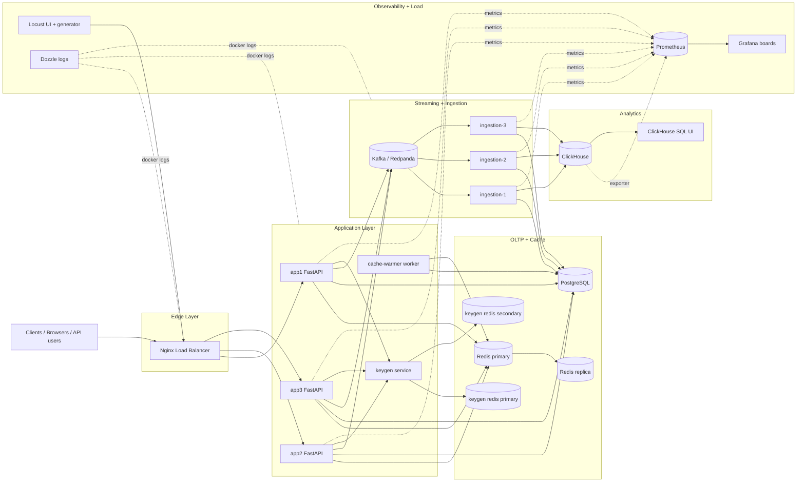

# Architecture

## Overview

This project runs a **distributed URL shortener platform** with:

- load-balanced stateless app nodes,
- split OLTP and OLAP responsibilities,
- asynchronous click ingestion,
- dedicated key-generation service,
- multi-layer observability and load testing.

It is designed to keep redirect latency low while preserving high write throughput and analytics fidelity.

## End-to-End Architecture Diagram

Static SVG: [`docs/diagrams/architecture.svg`](./diagrams/architecture.svg)

## Core Runtime Flows

### 1) Shorten URL (`POST /api/shorten`)

1. Client hits LB -> routed to one app node.
2. App requests a short-code range block from `keygen` when local block exhausts.
3. App validates uniqueness in Postgres.
4. URL mapping persisted in Postgres.
5. Cache entry populated in Redis.

### 2) Redirect (`GET /{short_code}`)

1. App checks Redis cache (`url:{short_code}`).
2. On miss: fetches from Postgres and warms cache.
3. Redirect response returns `307`.
4. Click event published to Kafka (fallback Redis stream available).
5. Near-real-time buffered click value stays in Redis for quick stats reads.

### 3) Ingestion / Analytics

1. Ingestion workers consume Kafka `click_events`.
2. They aggregate deltas in Redis hash.
3. Every 5 seconds, aggregated batch flushes to:
   - Postgres `urls.clicks` (OLTP truth for API stats),
   - ClickHouse `click_events` (analytics store).

## Service Inventory

| Layer | Services |
|---|---|
| Edge | `load-balancer` |
| App | `app1`, `app2`, `app3`, `keygen`, `cache-warmer` |
| OLTP | `db`, `redis`, `redis-replica`, `keygen-redis-primary`, `keygen-redis-secondary` |
| Stream | `kafka`, `ingestion-1`, `ingestion-2`, `ingestion-3` |
| OLAP | `clickhouse`, `clickhouse-dashboard` |
| Observability | `prometheus`, `grafana`, `dozzle` |
| Load generation | `load-ui`, `request-generator`, `request-generator-100k`, `request-generator-dist-master`, `request-generator-dist-worker` |

## Data Stores and Responsibility Split

| Store | Role | Notes |
|---|---|---|
| PostgreSQL | Source of truth for URL mappings + persisted click totals | ACID, indexed lookup by `short_code` |
| Redis | Low-latency cache + click aggregation buffers | Fast reads and temporary counters |
| Kafka | Durable click event transport | Decouples redirect path from write-heavy ingestion |
| ClickHouse | Analytics and reporting | Optimized for high-volume append and aggregate queries |

## Observability Surfaces

| UI | URL | Primary Use |
|---|---|---|
| Grafana | `http://localhost:3000` | Unified architecture board + service flow rates |
| Prometheus | `http://localhost:9090` | Raw metrics, target health, query debugging |
| Locust | `http://localhost:8089` | Live traffic generation + latency/failure during tests |
| ClickHouse UI | `http://localhost:8088` | Direct SQL analytics exploration |
| Dozzle | `http://localhost:9999` | Container logs and runtime behavior |
